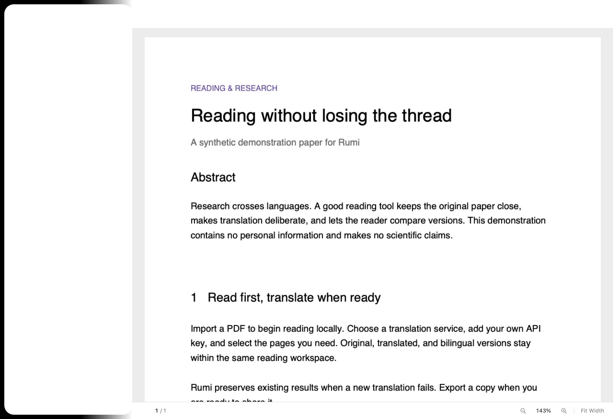

# Rumi

**Bring knowledge closer.** A free, open-source macOS app for reading and translating research papers with your own API.

[简体中文](README.zh-CN.md) · [Releases (beta in preparation)](https://github.com/linshenghou/Rumi/releases) · [Installation](docs/rumi/INSTALL.md) · [Privacy](PRIVACY.md) · [Contributing](CONTRIBUTING.md)

## Community Beta

Rumi 0.3.0 Beta 1 is being prepared. No public binary download is available yet. Download only assets attached to a published Rumi Release; a draft or local build is not an accepted public release. This community beta has **no Developer ID signature or Apple notarization**. First launch may require the steps in the [installation guide](docs/rumi/INSTALL.md).

- Apple Silicon (M1 or later), macOS 14 or later. Intel is not supported.
- Native PDF import, arXiv downloads, translation queues, and original / translated / bilingual reading.
- English and Simplified Chinese interface, search, page navigation, zoom, and PDF export.
- Bundled Python engine, fonts, and layout model. No Python installation or first-run model download required; local PDFs can be read offline.
- Bring a DeepSeek or OpenAI-compatible API. Rumi is free; your provider charges for API usage. Translation sends document text to that provider.

No Rumi account, subscription, hosted API, telemetry, or automatic updater. Community releases will be distributed through GitHub Releases, outside the Mac App Store. Layout and translation quality vary; see [known issues](docs/rumi/KNOWN_ISSUES.md).

## Start in three steps

1. Download the arm64 DMG and `SHA256SUMS.txt` from [Releases](https://github.com/linshenghou/Rumi/releases), verify the checksum, and drag Rumi into Applications.
2. Open Settings → Translation Service, enter your own API endpoint/model/key, and save. Connection testing makes a small API request and may incur a charge.
3. Drag in a PDF (⌘O), or add an arXiv link (⌘⇧O). Read locally, then choose pages and Translate (⌘↩). Switch reading versions and export with ⌘⇧E.

An upgrade preserves existing paper records. To reuse a key from the earlier PDFTranslate/Rumi preview, explicitly choose **Import Key from Previous App**, then Save. Failed import leaves the old key untouched; entering a new key also works. [Details](docs/rumi/INSTALL.md#upgrading).

## Build and contribute

See [build instructions](macos/README.md), [contribution guidelines](CONTRIBUTING.md), [roadmap](docs/rumi/ROADMAP.md), and the [release checklist](docs/rumi/RELEASE_CHECKLIST.md). Tests use a local mock API; contributors need no paid key.

Report ordinary bugs in [Issues](https://github.com/linshenghou/Rumi/issues). For vulnerabilities or leaked credentials, follow [SECURITY.md](SECURITY.md) and do not post secrets publicly.

## License and upstream

Rumi is an independently maintained fork of [PDFMathTranslate-next](https://github.com/PDFMathTranslate-next/PDFMathTranslate-next), built on [BabelDOC](https://github.com/funstory-ai/BabelDOC). Upstream history, copyright notices and the [AGPL-3.0 license](LICENSE) are retained. The Python package keeps its upstream name and version; the desktop product has its own release metadata.

Each binary release must include its matching complete source archive, locked dependency information, build instructions, notices, and SHA-256 checksums. Third-party components retain their own licenses; see the [redistribution review](docs/rumi/LICENSE_REVIEW.md). The original project documentation remains available in [README-upstream.md](README-upstream.md) and `docs/`.
